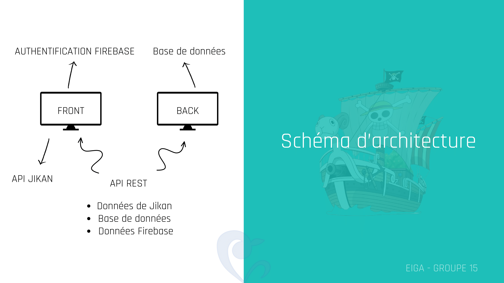

# Architecture technique[<a href="linelinlove.github.io/hetic-architecture/"></a>] Par Groupe 15

- [Architecture technique](#architecture-technique)
  - [Description](#description)
  - [Contributeurs](#contributeurs)
  - [Fonctionnalités](#fonctionnalités)
  - [Stack](#stack)
  - [Tools](#tools)
    - [Sécurité](#sécurité)
  - [Bonnes pratiques](#bonnes-pratiques)
    - [Design Patterns](#design-patterns)
  - [Prérequis](#prérequis)
  - [Installation](#installation)
  - [Lancer les tests](#lancer-les-tests)
  - [Déploiement](#déploiement)
  - [Contribuer](#contribuer)
  - [Documentation](#documentation)
  - [Licence](#licence)
  - [Ressources Supplémentaires](#ressources-supplémentaires)
    - [Sitographie](#sitographie)
  - [Remerciements](#remerciements)
  - [FAQ](#faq)

## Description

Ce projet Eiga est une application web conçue pour les passionnés d'animation japonaise. Elle utilise les technologies suivantes: React, Vite, PHP et suit les meilleures pratiques de développement front-end et back-end.

## Contributeurs

<ul>
  <li><a href="https://github.com/MrStagiaire">Lorys L.</a></li>
  <li><a href="https://github.com/LinelinLove">Chrisline L.</a></li>
  <li><a href="https://github.com/Myakii">Rosine Y.</a></li>
  <li><a href="https://github.com/ImThari">Tharishanan M.</a></li>
  <li><a href="https://github.com/Jyaax">Julie L.</a></li>
  <li><a href="https://github.com/CapriceSeum">Luc L.</a></li>
</ul>

## Fonctionnalités

- comments.php : Cette fonctionnalité PHP permet de gérer les commentaires liés à des animes. En mode GET, elle récupère les commentaires associés à un anime spécifique depuis une base de données, tandis qu'en mode POST, elle ajoute un nouveau commentaire à la base de données, incluant l'identifiant de l'utilisateur, de l'anime, le titre de l'anime et le contenu du commentaire. Les réponses sont renvoyées au format JSON avec des indications sur le statut de l'opération.
- db_connexion.php : Ce script PHP, lorsqu'accédé via une requête, vérifie la connexion à une base de données en utilisant la classe DatabaseManager. En cas de réussite, il renvoie une réponse JSON indiquant le succès de la connexion avec un message informatif. En cas d'échec, il renvoie une réponse JSON signalant l'échec de la connexion et inclut un message d'erreur détaillé provenant de l'exception PDO.
- favorite.php : Ce script PHP gère les opérations liées aux favoris d'animes. En mode GET, il vérifie si une association entre l'utilisateur (userId) et l'anime (animeId) existe dans la table list_favorite de la base de données. En mode POST, il ajoute une nouvelle entrée indiquant que l'utilisateur a ajouté l'anime à ses favoris, tandis qu'en mode DELETE, il supprime cette association, signalant la réussite ou l'échec de l'opération via des réponses JSON.
- getCommentPerUser.php : Ce script PHP, en mode GET, récupère les commentaires associés à un utilisateur spécifique (userId) depuis la base de données. Il effectue une jointure entre les tables des commentaires et des utilisateurs pour obtenir les détails du commentaire, tels que le contenu, la date, le titre de l'anime et l'identifiant de l'anime. Les résultats sont renvoyés au format JSON, signalant le succès ou l'échec de l'opération.
- getFavoritePerUser.php : Ce script PHP, en mode GET, récupère la liste des animes marqués comme favoris par un utilisateur spécifique (userId) depuis la base de données. Les résultats sont ordonnés par titre d'anime de manière ascendante, et la réponse est renvoyée au format JSON, indiquant le statut de l'opération et les données récupérées ou un message d'erreur en cas d'utilisateur non trouvé.
- getNotePerUser.php : Ce script PHP, en mode GET, récupère les notes attribuées par un utilisateur spécifique (userId) aux différents animes depuis la table "note" de la base de données. Les résultats sont ordonnés par titre d'anime de manière ascendante, et la réponse est renvoyée au format JSON, indiquant le statut de l'opération et les données récupérées, ou un message d'erreur en cas d'utilisateur non trouvé.
- getNotePerUserAnime.php : Ce script PHP, en mode GET, récupère la note attribuée par un utilisateur spécifique (userId) à un anime particulier (animeId) depuis la table "note" de la base de données. La réponse est renvoyée au format JSON, indiquant le statut de l'opération et la note attribuée, ou un message d'erreur en cas d'utilisateur non trouvé.
- getWatchlistPerUser.php : Ce script PHP, en mode GET, récupère la liste des animes présents dans la watchlist d'un utilisateur spécifique (userId) depuis la table "watchlist" de la base de données. Les résultats sont renvoyés au format JSON, indiquant le statut de l'opération et les données récupérées, ou un message d'erreur en cas d'utilisateur non trouvé.
- nb_episode.php : Ce script PHP, en mode GET, récupère le numéro d'épisode actuel d'un anime spécifique (animeId) dans la watchlist d'un utilisateur (userId) depuis la table "watchlist" de la base de données. En mode POST, il met à jour le numéro d'épisode actuel pour cet anime dans la watchlist de l'utilisateur en fonction des données fournies. Les réponses sont renvoyées au format JSON, indiquant le statut de l'opération et les données récupérées ou un message d'erreur en cas d'utilisateur non trouvé ou d'échec de la mise à jour.
- note.php : Ce script PHP, en mode GET, récupère la note générale (moyenne) et le nombre total de notes attribuées par les utilisateurs à un anime spécifique (animeId) depuis la table "note" de la base de données. En mode POST, il permet aux utilisateurs de soumettre ou mettre à jour leur note pour cet anime, en enregistrant ces informations dans la base de données. Les réponses sont renvoyées au format JSON, indiquant le statut de l'opération et les données récupérées ou un message d'erreur en cas d'utilisateur non trouvé ou d'échec de la mise à jour.
- settings.php : Ce script PHP permet de gérer les informations utilisateur. En mode GET, il récupère les données utilisateur associées à un identifiant Firebase (uidFirebase) depuis la table "user" de la base de données. En mode POST, il met à jour les informations utilisateur, telles que le nom, le prénom, le numéro de téléphone, la date de naissance, le genre et la photo de profil, en fonction des données fournies. Les réponses sont renvoyées au format JSON, indiquant le statut de l'opération et les données mises à jour ou un message d'erreur en cas d'utilisateur non trouvé ou d'échec de la mise à jour. La validation et la sécurisation des valeurs des paramètres sont recommandées pour éviter les vulnérabilités.
- signup.php : Ce script PHP gère l'inscription d'un nouvel utilisateur. En mode POST, il récupère les données fournies (nom d'utilisateur, email, mot de passe haché, et UID Firebase), effectue des validations appropriées, puis insère ces données dans la base de données. Les réponses sont renvoyées au format JSON, indiquant le statut de l'opération et un message informatif. Il utilise le hachage bcrypt pour stocker de manière sécurisée le mot de passe de l'utilisateur. Des validations supplémentaires peuvent être ajoutées pour renforcer la sécurité.
- users.php : Ce script PHP, en mode GET, récupère les informations de l'utilisateur spécifique identifié par son ID (id) depuis la table "user" de la base de données. Les données telles que le nom d'utilisateur, le prénom, le nom de famille, le genre, la photo de profil et la date de naissance sont extraites et renvoyées au format JSON. En cas de succès, la réponse indique le statut "success" et les données de l'utilisateur, sinon, elle signale une erreur avec un message approprié.
- watchlist.php : Ce script PHP gère les mises à jour du statut d'un anime dans la watchlist d'un utilisateur. En mode GET, il récupère le statut de l'anime spécifié (animeId) pour un utilisateur particulier (userId) depuis la table "watchlist" de la base de données. En mode POST, il permet aux utilisateurs de mettre à jour le statut de l'anime dans leur watchlist, ajoutant, modifiant ou supprimant l'entrée en fonction des données fournies. Les réponses sont renvoyées au format JSON, indiquant le statut de l'opération et les données mises à jour ou un message d'erreur en cas d'utilisateur non trouvé ou d'échec de la mise à jour.

## Stack

- **Backend** : [Nodejs](https://nodejs.org/) + [Fastify](https://www.fastify.io/)
- **Frontend** : [React](https://reactjs.org/)
- **BDD** : [PostgreSQL](https://www.postgresql.org/)
- **Conainerisation** : [Docker](https://www.docker.com/)
- **Architecture** : Fonctionnement microservice

## Tools

- **Tests** : [Jest](https://jestjs.io/)
- **CI/CD** : [GitHub Actions](https://github.com/features/actions)
- **Code Quality** : [ESLint](https://eslint.org/) + [Prettier](https://prettier.io/)
- **Prettier** : [Prettier](https://prettier.io/)
- **Hosting** : [Vercel](https://www.vercel.com/)
- **Commits** : [Commitizen](<[https://](https://github.com/commitizen/cz-cli)>)
- **Components** : [Storybook](https://storybook.js.org/)
- **CSS** : [Tailwind](https://tailwindcss.com/)
- **Git** : [git scm](https://git-scm.com/)
- **FIGMA** : [Figma](https://www.figma.com/file/mPasNYECl0W7Yp457kBbWZ/Projet-Architecture?type=design&node-id=0%3A1&mode=design&t=ldrP7wd1CYbiiYnA-1)
- **Trello** : [Trello](https://trello.com/invite/b/tMHQ4JN9/ATTI396dd2b81c8eb00fbb5ed3aa33790bc6C6DA79DD/eiga)
- **Dbdiagram** : [Dbdiagram](https://dbdiagram.io/d/eiga-archi-654e2f517d8bbd6465ee852a)
- **VSCODE** : [Visual Studio Code](https://code.visualstudio.com/)

### Sécurité

- [Firebase](https://firebase.google.com/)

## Bonnes pratiques

- CAMEL CASE
- Commentaires
- CLEAN CODE
- Atomic design

### Design Patterns

## Prérequis

- [Lister les prérequis pour installer et exécuter le projet.]
- [Node.js](https://nodejs.org/en/)
- [npm](https://www.npmjs.com/)
- [VITE](https://vitejs.dev/)
- [PHP](https://www.php.net/)
- [Serveur apache(wamp, xamp,...)](https://www.apachefriends.org/fr/index.html)
- [Mysql](https://www.mysql.com/fr/)

## Installation

- 1. Cloner le projet :
```bash
git clone [URL du dépôt]
```
- 2. Installer les dépendances :
```bash
npm install
```
- 3. [Autres étapes spécifiques au projet]
- 4. Lancer le projet :
```bash
npm start
```

## Lancer les tests

```bash
npm test
```

## Déploiement

Dans le dossier "architecture-anime-manga", il faut lancer la commande " npm i",
Renommer le env.sample en .env  dans hetic-architecture/backend/.env,
Copier/coller :
DB_HOST=localhost
DB_NAME=eiga_bdd
DB_USER=root
DB_PASSWORD=
Créer un autre fichier se nommant .env dans hetic-architecture/architecture-anime-manga/.env,
Copier/Coller :
[Envoie par mail]

## Contribuer

- Forker le projet
- Créer une branche pour votre fonctionnalité (`git checkout -b feature/AmazingFeature`)
- Commit vos changements (`git commit -m 'Add some AmazingFeature'`)
- Push sur la branche (`git push origin feature/AmazingFeature`)
- Ouvrir une Pull Request

## Documentation

Lien vers la documentation complète du projet, si disponible ou un document, par exemple un fichier `docs/README.md` à la racine du projet.

## Licence

Ce projet est sous licence Eiga - 2023.

## Ressources Supplémentaires

Liens vers des ressources externes, tutoriels, ou documentations qui ont été utiles :

- API Jikan qui nous a permis d'importer les éléments essentiels pour les animes (https://docs.api.jikan.moe/)
- Une playlist expliquant comment créer un API avec PHP (https://www.youtube.com/watch?v=M1DK7vdeu8c&list=PLH0EZmvdCcKHnbQZ26DS2_yBBZvzpDF_s)
- Documentaire pour le css vanilla (https://developer.mozilla.org/fr/docs/Web/CSS)

### Sitographie

- ()

## Remerciements

« Je tiens à exprimer ma profonde gratitude envers Chrilsine L. dont l'engagement et l'expertise ont été inestimables, rendant ainsi notre projet bien plus fluide. Un immense merci à Luc L. pour son rôle exceptionnel de Chef de projet, orchestrant nos efforts de manière exemplaire. Mes remerciements vont également à Julie L. pour son organisation impeccable de la présentation, à Tharishanan M. pour la structure exceptionnelle du Front-End, à Rosine Y. pour son rôle crucial dans la coordination de la présentation, à Lorys L. pour son soutien continu à Julie L., et enfin, à Alex Z. qui a été un soutien constant tout au long du projet. Votre contribution exceptionnelle a été la clé de la réussite de notre équipe. Merci infiniment. »

- Sources d'inspiration :
  Notre principale source d'inspiration pour ce projet a été Animelist, un site spécialisé dans la catalogation d'animes. Nous avons cherché à tirer des leçons de leur approche pour créer une expérience utilisateur similaire et enrichissante dans notre propre projet. De plus, nous nous sommes également tournés vers AniList et Nautijon pour explorer d'autres perspectives et intégrer des éléments innovants dans notre conception.

## FAQ

- Quels types d'animes sont répertoriés sur le site d'Eiga ?
- > Eiga répertorie une vaste gamme d'animes, allant des classiques aux dernières sorties, couvrant divers genres et styles.

- Comment fonctionne le système de notation sur Eiga ?
- > Les utilisateurs peuvent noter les animes sur une échelle de 1 à 10, partageant ainsi leurs évaluations et contribuant à la création d'une communauté engagée.

- Quelle était la motivation derrière la création d'Eiga ?
- > L'équipe d'Eiga était motivée par la passion commune pour les animes et l'aspiration à fournir une plateforme conviviale pour les amateurs du genre.

- Est-ce que Eiga propose des fonctionnalités sociales pour les utilisateurs ?
- > Eiga répertorie une vaste gamme d'animes, allant des classiques aux dernières sorties, couvrant divers genres et styles.

- Quels types d'animes sont répertoriés sur le site d'Eiga ?
- > Non, c'est quelque chose que nous souhaitons mettre en place afin d'avoir plus d'interaction sociale, notamment avec une liste de favoris. Pourquoi pas un salon de discussion, ainsi qu'un forum ou un Discord
